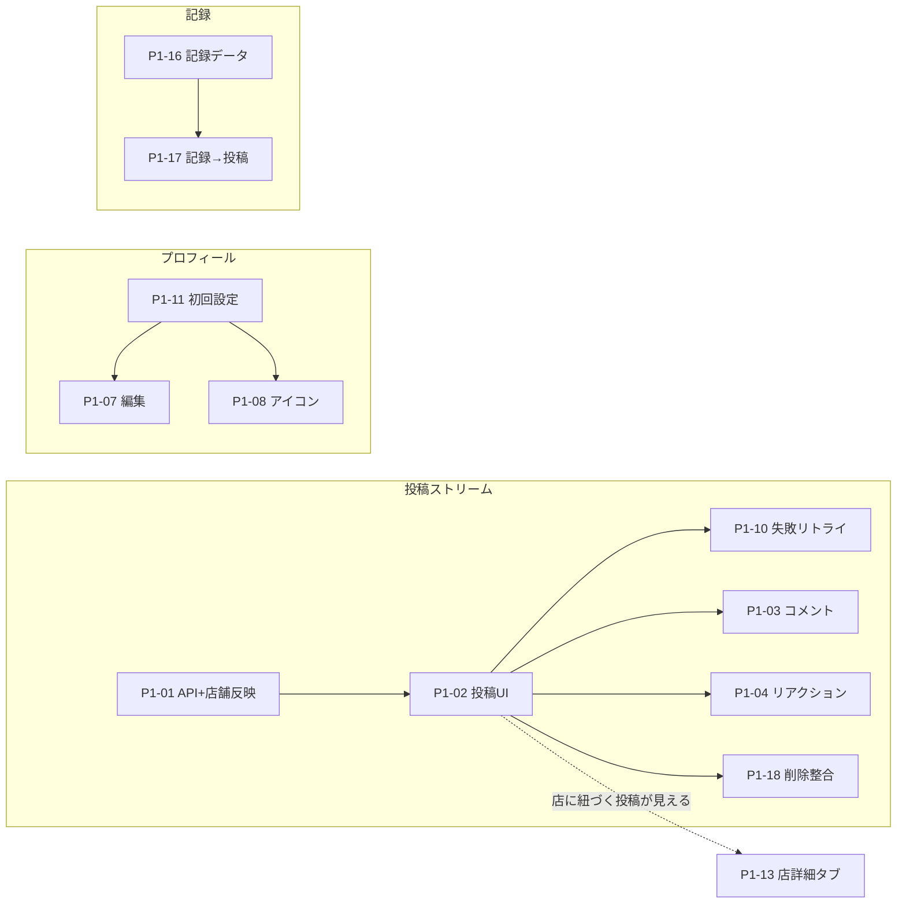

# Phase 1 タスク一覧（5/22期限）

> 目的: モニター/内部検証で「主要導線が実利用できる」状態を作る  
> ルール: DBスキーマ変更は禁止（PMのみ）
>
> **コンポーネント方針**: Phase1では共通コンポーネントの新設・カタログ化は行わない。画面は必要に応じて素直に実装する（ボタン等の共通化・置き換えは **Phase2** で着手する）。
>
> **メンバー向け個票（1タスク1ファイル）**: [assignments/README.md](./assignments/README.md)  
> **PMが先に実装する範囲**: [pm-only/PM-PRE-DISTRIBUTION-IMPLEMENTATION.md](../pm-only/PM-PRE-DISTRIBUTION-IMPLEMENTATION.md)  
> **仕様→個票の抜け漏れ防止（カバレッジ表）**: [assignments/SOURCE-TO-TASK-COVERAGE.md](./assignments/SOURCE-TO-TASK-COVERAGE.md)

### PM配布前スコープ（5コアの切り分け）

- **PMが配布前に縦に通す（4）**: 投稿は **「投稿できる」最小**まで、タイムライン取得、店詳細取得、マップピン取得。詳細は `doc/pm-only/PM-PREREQUISITES-BEFORE-ASSIGN.md` 節0。
- **メンバー向けに残す（フォロー）**: フォロー／解除（`P1-05` レーンなど）は従来どおり配布可。

### 投稿（PM最小のあとメンバー向けに切るタスク）

PMが「作成〜一覧に載る」まで届けたあと、次の **個票** を割り振る（`P1-10` と分担・統合は PM が調整）。

| ID | 個票 |
|----|------|
| P1-22 | [TASK-P1-22-post-caption-validation.md](./assignments/TASK-P1-22-post-caption-validation.md) |
| P1-23 | [TASK-P1-23-post-location-default.md](./assignments/TASK-P1-23-post-location-default.md) |
| P1-24 | [TASK-P1-24-post-camera-place-polish.md](./assignments/TASK-P1-24-post-camera-place-polish.md) |
| P1-25 | [TASK-P1-25-post-visibility-ui.md](./assignments/TASK-P1-25-post-visibility-ui.md) |
| P1-26 | [TASK-P1-26-home-cooking-post-flow.md](./assignments/TASK-P1-26-home-cooking-post-flow.md)（自炊導線・`whoeats-screen-spec-v1` 6.7 準拠） |
| P1-27 | [TASK-P1-27-post-type-badges.md](./assignments/TASK-P1-27-post-type-badges.md)（外食／自炊バッジ） |

### 画面仕様の抜けから切った個票（`SOURCE-TO-TASK-COVERAGE` 準拠）

| ID | 個票 |
|----|------|
| P1-28 | [TASK-P1-28-notifications-inbox.md](./assignments/TASK-P1-28-notifications-inbox.md) |
| P1-29 | [TASK-P1-29-post-companion-field.md](./assignments/TASK-P1-29-post-companion-field.md) |
| P1-30 | [TASK-P1-30-map-pin-bottom-sheet.md](./assignments/TASK-P1-30-map-pin-bottom-sheet.md) |
| P1-31 | [TASK-P1-31-profile-pinned-posts.md](./assignments/TASK-P1-31-profile-pinned-posts.md) |
| P1-32 | [TASK-P1-32-record-nutrition-ai.md](./assignments/TASK-P1-32-record-nutrition-ai.md) |
| P1-33 | [TASK-P1-33-timeline-scope-ui.md](./assignments/TASK-P1-33-timeline-scope-ui.md) |
| P1-34 | [TASK-P1-34-map-friend-pin-3d-fallback.md](./assignments/TASK-P1-34-map-friend-pin-3d-fallback.md) |

---

## 5人に振るときの前提（重要）

**このファイルの「P0→P1→P2」の並びは、5人への割り当て順ではない。**  
タスク番号の若い順に一人ずつ取らせると破綻する（例: `P1-02` を `P1-01` より先にやるのは不自然）。

### 依存の骨（最低限これだけ守る）

- **投稿**: `01 → 02` はこの順固定。その後に `03, 04, 10, 18` が並びやすい。
- **コメント/リアクション**: 投稿が成立してから（実質 `02` 以降。APIモックで先行する場合はPMと合意）。
- **店詳細タブ `13`**: 店＋投稿が流れてから着手すると楽（`01/02` と並行は可能だが結合テストは後半）。
- **記録**: `16 → 17` の順固定。
- **プロフィール**: `11` が先（認証後初回）。その後 `07, 08`。
- **横断 `09`（状態UI統一）**: **初動の並列5本には入れない**のがおすすめ。文言・パターンの合意は早めでもよいが、各画面の実装が一通り動いてから横断で当てるとコンフリクトが減る。

### 初動で並列に振るおすすめ5本（`09` は含めない）

| 順 | タスク | メモ |
|----|--------|------|
| 1 | `P1-01` | 投稿ストリーム先頭 |
| 2 | `P1-11` | 認証直後フロー |
| 3 | `P1-12` | ホーム2ペイン（投稿APIを待たず進めやすい） |
| 4 | `P1-16` | 記録データ（投稿チェーンと独立しやすい） |
| 5 | `P1-05` | フォロー（APIが出ていれば。無ければ `P1-06` 検索に置換） |

`P1-09` は **第2波以降**（例: 主要PRが一通りマージした週）にまとめて担当を立てる。

### 5レーン割り当て例（担当はPMが決める）

| レーン | 主担当タスク（目安順） | ブロッカー / 注意 |
|--------|------------------------|-------------------|
| **A 投稿** | `01` → `02` → `10` → `18`（必要なら `03` `04` も同一レーン） | `01` 未完了なら `02` の本接続は詰まる |
| **B 反応** | `03`, `04`（`02` 完了後に本番結線） | 先にモック投稿でUIだけ進めるならPMと合意 |
| **C 友達** | `05` → `14` → `06` → `15` | `14` は `05` と整合が取りやすい順 |
| **D プロフィール** | `11` → `07` → `08` | 認証・`users` が前提（PM側） |
| **E 記録・店** | `12` / `16` → `17` / `13` | `09` はここに含めず後半で横断。`13` の結合は `01/02` 後半が安全 |

レーン数が5未満なら、**A+B を1人**や **D+E を1人**のように寄せてよい。

---

## P0（最優先）

### TASK-P1-01 投稿作成API + 店舗反映
- `restaurant` 投稿時の `place_id` 紐付け
- 投稿直後に店詳細/タイムラインへ反映

### TASK-P1-02 投稿作成UI完成
- 撮影→店候補確認→手動変更→投稿
- 公開範囲選択（public/friends/private）を実装

### TASK-P1-03 コメント機能
- 投稿コメントの一覧/作成/削除
- バリデーション（空/文字数）追加

### TASK-P1-04 リアクション機能
- likeトグルとカウント更新
- 通信失敗時ロールバック

### TASK-P1-05 フォロー/解除接続
- 候補画面のフォローボタン接続
- 状態不整合防止

### TASK-P1-06 `@user_code` 検索
- 前方一致検索
- 結果カードからフォロー導線

### TASK-P1-07 プロフィール編集
- 表示名/Bio/デフォルト公開範囲編集
- 保存成功/失敗UI

### TASK-P1-08 アイコン編集
- 画像選択→プレビュー→更新
- 更新後の全画面反映

### TASK-P1-09 状態UI統一（後半・横断推奨）
- loading/empty/error/permission/offline 表示を統一
- **初動の並列5本には入れない**想定（他タスクのPRが増えてからの方が安全）

### TASK-P1-10 投稿失敗時リトライ導線
- 投稿API失敗時の再試行UI
- 入力内容の保持

## P1（重要）

### TASK-P1-11 認証後の初回プロフィール初期設定フロー
- 初回ログイン後にプロフィール初期設定へ遷移
- `name`, `user_code`, `icon` の初期登録導線を実装

### TASK-P1-12 ホーム2ペイン（投稿/マップ）状態保持
- タブ切替時にスクロール位置・表示状態を保持
- スワイプ/タップ切替の両対応を確認

### TASK-P1-13 店詳細タブ切替
- 友達/近い人/全体 の切替表示
- 0件時案内を追加

### TASK-P1-14 ブロック/解除
- ブロック時の相互非表示制御
- 解除時の復帰確認

### TASK-P1-15 フォロー/フォロワー一覧導線
- ~~プロフィールから一覧遷移~~ → **Cancelled（2026-05-29）**: 友達のみ方針。代替は [sprint-1-active-20260529.md](../../sprint-1-active-20260529.md) **FR-1〜FR-4 友達申請 UI**

### TASK-P1-16 記録画面データ接続
- カレンダー日別サマリ表示
- 月間傾向の表示

### TASK-P1-17 記録→投稿詳細遷移
- 記録一覧から投稿詳細へ遷移
- 存在しない投稿時のハンドリング

### TASK-P1-18 投稿削除整合
- 投稿本体 + 画像参照の整合削除
- 削除後の各画面非表示を確認

## P2（追い込み）

### TASK-P1-19 バグトリアージ
- Critical/High優先修正
- 再現手順テンプレ運用

### TASK-P1-20 テストパック
- コアフローのunit/widget/手動テスト追加

### TASK-P1-21 Phase1レビュー用エビデンス整理
- Before/Afterスクショと確認結果を整理
- モニター向け確認手順を整備

## 受け入れ基準（全タスク）
1. `flutter analyze` 通過  
2. Before/Afterスクショ添付  
3. 仕様外変更はPRに明記  
4. DB変更が必要な場合は実装せずPMへIssue起票

