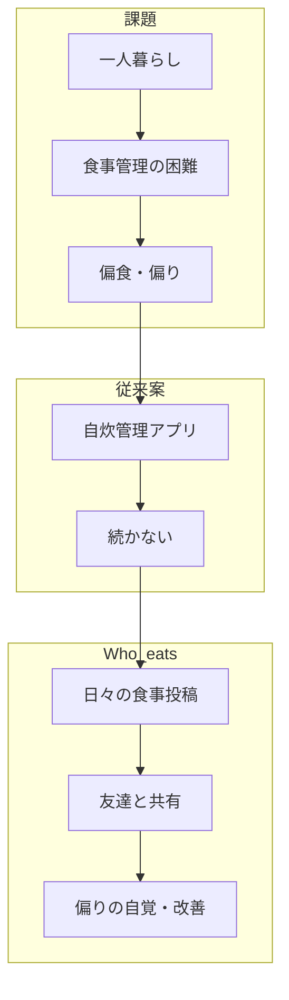

# 課題1 — 社会課題の調査・ディスカッション

> **プロダクト**: Who eats  
> **本質的な課題**: 一人暮らし大学生の **食生活管理の困難** と **偏食**（自炊・外食を問わない）  
> **公式ストーリー**: [who-eats-narrative.md](./who-eats-narrative.md)

---

## 1. 取り上げる社会課題

**大学生が一人暮らしを始めたあと、食事の管理がうまくいかず、偏食や食生活の偏りが続いてしまうこと**

急な単身生活では、食事の時間・内容・バランスを自分でコントロールする必要があるが、調理スキル・買い出し・モチベーションが追いつかない場合が多い。結果として、コンビニ・外食の固定化、栄養の偏り、食事回数の乱れ（朝食抜きなど）が起きやすい。

本班では、この問題を **「食べること全般の管理と偏りの防止」** として捉え、情報技術で **継続可能に支える** ことを目指す。

※ 外食先の選びづらさ（匿名レビューへの不信など）は **関連する副次的課題** であり、後述の地図・友達機能で扱う。

---

## 2. 背景となる問題意識

### 2.1 一人暮らしと食生活の混乱

- 実家では当たり前だった食事のリズムが自分で作れない
- 「何を食べたか」を振り返る習慣がなく、偏りに気づきにくい
- 自炊しようとしても続かない、または同じメニューの繰り返しになる

### 2.2 偏食・食の偏り

- 外食・コンビニに偏る
- 特定ジャンル（麺類・ファストフードなど）ばかりになる
- 野菜・朝食などが抜けがちになる

### 2.3 既存の「管理系」アプリでは続かない

- カロリー入力・献立表型は **負担が大きく、数日でやめる** という体験が班内でも共有された
- 継続には **手軽さ** と **他者とのつながり** が重要

### 2.4 外食時の意思決定（関連課題）

- 匿名の高評価店舗情報は、食生活全体の改善にはつながりにくい
- 信頼できる友人の食事内容・行った店の方が、**偏りの少ない選択** の参考になる

### 2.5 班内ディスカッションで共有した観点（記入欄）

| 班員 | 自分が直面した例・エピソード |
|------|------------------------------|
| 【要記入】 | 例: 一人暮らし開始後の偏食、自炊が続かなかった |
| 【要記入】 | |
| 【要記入】 | |

---

## 3. 社会的な意義・普遍性

| 観点 | 説明 |
|------|------|
| **切実性** | 進学・就職等で単身生活を始める層に多い「最初の1年」の食の乱れ |
| **普遍性** | 高齢単身者・単身赴任など「自分で食事を決める」場面は広い |
| **健康・社会性** | 若年期の食生活は将来の健康リスクにも関わる（公的統計・保健指導と接続可能） |
| **情報技術** | 記録・可視化・（将来）画像解析・友人ネットワークで **続く支援** が可能 |

社会的価値: **偏食・食生活の偏りを防ぎ、自炊・外食を含めた「続く記録」** を通じて、一人暮らし世代の食の不安を減らす。

---

## 4. 課題設定の経緯（班の意思決定）

| 段階 | 内容 |
|------|------|
| **当初** | 自炊管理・食事記録に特化したアプリ案 |
| **課題** | 入力負荷が高く **持続しない** |
| **転換** | **日々投稿しやすい SNS 形式**（写真＋短いメモ）＋ **友達との共有** |
| **現在** | 自炊・外食の両方を投稿し、フィード・地図で振り返る **Who eats** |

詳細は [who-eats-narrative.md](./who-eats-narrative.md)。

---

## 5. 既存の解決方法の調査結果

| 手段 | 概要 | 本課題に対する限界 |
|------|------|---------------------|
| カロリー・献立アプリ | 数値管理・献立提案 | 継続率が低い、社会的動機づけが弱い |
| Google マップ / 食べログ | 店・匿名レビュー | **食生活全体・偏食** は見えない |
| 一般 SNS | 食事写真の共有 | 構造化・偏り分析・振り返りに弱い |
| 自炊専用アプリ | レシピ・買い物リスト | 外食が生活の中心の週に使えない |

**結論**: 「管理」だけでも「グルメ」だけでも不十分。**食生活・偏食を主題に、友達と続けられる記録** が必要。

---

## 6. 課題1の結論（課題2へ）

本班が取り組む社会課題は、

> **一人暮らし等で食生活の管理が難しく偏食になりがちな大学生に対し、継続可能な食事記録と友人との共有により、自炊・外食を問わず食の偏りを防ぐこと**

である。情報技術による解決として、課題2では **SNS 型食事投稿アプリ Who eats** を立案する。

---

## 図表案（中間レポート用）

---

## 参考文献（【要記入】）

1. 【要記入：若年層の食生活・一人暮らしに関する統計や記事】
2. 【要記入】
