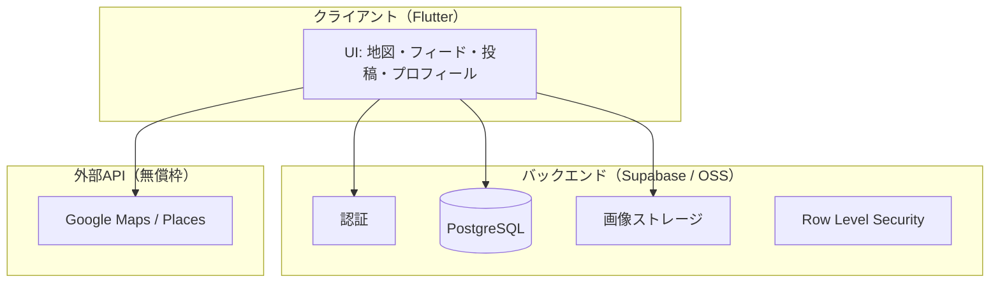

# 課題2 — 情報技術による課題解決方法の立案

> **前提**: オープンソース／無償ソフトウェア。有償ツールを使う場合も **無償で実現する代替** を併記。  
> 中間レポート「課題2」節のたたき台。

---

## 1. 問題の具体化

> **経緯・本質**: [who-eats-narrative.md](./who-eats-narrative.md)

### 1.1 解決したいこと（一文）

**一人暮らし大学生などの食生活の偏り・偏食を防ぐため、自炊・外食を問わず「続く」食事記録と友達との共有を可能にするモバイルアプリ** を提供する。

地図・友達フィードは、外食時の選択支援と **継続の動機づけ** のための **手段** である。

### 1.2 なぜ SNS 型か（設計の理由）

| 当初案 | 課題 | 現案 |
|--------|------|------|
| 自炊管理・入力中心アプリ | 持続しない | 写真＋短い投稿で **日々続けやすい** |
| 一人記録 | モチベーションが続かない | **友達のタイムライン** で見られる・真似できる |

### 1.3 何をどこまで解決するか（スコープ）

| 区分 | 課題3までに目指す範囲 | 今回の範囲外（将来・展望） |
|------|------------------------|---------------------------|
| **Must** | 認証、食事投稿（**自炊／外食**・写真・店紐付け）、ホームフィード、地図ピン、フォロー／友達、いいね・コメント | AI による偏り分析、1日3食の厳密管理 |
| **Should** | フィード表示範囲、プロフィール・**記録タブ**、店舗詳細から地図フォーカス | 栄養士スポンサー連携の本番運用 |
| **Could** | ストリーク・バッジ、同行者記録 | 事業化・有料プレミアム分析 |

**落としどころ**: 授業時間内で **エンドツーエンドの一連の体験**（ログイン → 投稿 → 友達の投稿が地図・フィードに見える）をデモできるプロトタイプ。

---

## 2. 解決方法のアプローチ

### 2.1 コンセプト

- **本質（レポートで常に強調）**: 自炊・外食を含む **食生活の記録** と **偏食・偏りの防止**
- **キャッチ（対外）**: 「知らない星5より、友達の一枚」
- **手段**: 友達の食事投稿・地図で **続く習慣** と **外食時の信頼できる選択** を支える

### 2.2 システム構成（論理）



### 2.3 利用技術と選定理由

| 技術 | 種別 | 選定理由 |
|------|------|----------|
| **Flutter** | OSS（BSD） | iOS/Android を1コードベースで開発。授業デモは PC エミュレータ／実機 |
| **Dart** | OSS | Flutter 標準言語 |
| **Supabase** | OSS コア + 無償枠 | PostgreSQL、認証、Storage、RLS でバックエンドを短期構築 |
| **PostgreSQL** | OSS | リレーション・RPC（例: 近い人フィード用 ID 取得） |
| **google_maps_flutter** | OSS プラグイン | 地図表示。API キーは Google Cloud 無償枠 |
| **provider** | OSS | 状態管理（ChangeNotifier） |

**有償との関係**: Google Maps Platform は無料枠内での利用を想定。完全オフライン代替として OpenStreetMap 等も検討可能だが、MVP では Places 連携を優先。

**ライセンス**: 利用 OSS のライセンス条項を確認し、第三者公開が必要な場合は授業ルールに従い **プライベートリポジトリ** で管理。

---

## 3. 主要機能とシナリオ

### 3.1 ユーザーシナリオ（代表）

1. ユーザー A がログインし、外食後に写真を投稿（位置情報から近傍店を候補表示、必要なら手動修正）。
2. ユーザー B（A の友達）がホームで「友達」スコープのフィードを見て、A の投稿にいいね・コメント。
3. B がマップタブで、友達が行った店のピンを確認し、店舗詳細から地図上の該当店にフォーカス。
4. B が `@user_code` で C を検索し、フォロー申請 → 相互フォローで「友達」関係成立。

### 3.2 フィード表示範囲（設計）

| スコープ | 意味 | 実装方針（概要） |
|----------|------|------------------|
| **友達** | 相互フォロー + 自分 | クライアント／DB で投稿者 ID をフィルタ |
| **近い** | 友達 + 2ホップのつながり | RPC `get_near_feed_user_ids` 等 |
| **すべて** | アプリ内の公開投稿 | RLS と公開設定に従い取得（件数上限あり） |

初期表示はプロフィール設定で **友達** をデフォルトとし、ユーザーが変更可能。

---

## 4. データ設計の概要

- **users / profiles**: 表示名、`@user_code`、アバター
- **posts**: 画像、店 place_id、コメント、評価、公開範囲
- **follows**: フォロー関係（友達は相互）
- **likes / comments**: ソーシャル反応
- **blocks**: ブロックユーザー

詳細は `doc/db-table-design-final-mvp.md` を参照。

---

## 5. 実現に向けたシナリオ（デモ想定）

**ポスター・最終発表で見せる流れ（5分デモ想定）**

1. ログイン（メール or ソーシャル）
2. ホームで友達の投稿をスクロール、コメントを1件表示＋「他N件」
3. マップでピンタップ → ボトムシート → 「店舗詳細」で地図タブへジャンプ
4. 撮影タブから新規投稿（デモ用アカウント）
5. プロフィールでフィード初期表示スコープを変更

---

## 6. 今後の展望（中間・最終レポートに必ず記載）

### 6.1 技術的展望

| 機能 | 内容 | 課題との関係 |
|------|------|----------------|
| **AI 画像解析** | 投稿写真から食品カテゴリを推定し、**食事の偏り**（野菜不足・特定栄養素の偏り等）を分析 | 偏食の **定量的な可視化** |
| **食事回数の管理** | **1日1・2・3食** が取れているかの記録・リマインド | 食事管理の困難への直接対応 |
| **記録タブの拡張** | 週間の食種バランス・外食/自炊比率のサマリー | 振り返りによる行動変容 |

### 6.2 事業・スポンサー計画（展望）

| 項目 | 概要 |
|------|------|
| **スポンサー候補** | 管理栄養士・栄養士、大学保健センター、健康・食品関連企業 |
| **スポンサーへの価値** | 大学生への健康啓発、偏食改善プログラムの実施基盤、監修ブランド |
| **アプリへの価値** | 専門監修の分析・コンテンツ、相談窓口、信頼性の向上 |
| **収益モデル（案）** | スポンサーシップ、大学向けパッケージ、将来のプレミアム分析（基本機能は無償維持） |

※ 課題3の授業スコープでは **プロトタイプ未実装**。ミニ発表・レポートの「今後」節で述べる。

---

## 7. 課題3 に向けた作業計画・分担

### 7.1 フェーズ分割（WBS 概要）

| フェーズ | 内容 | 目安週 |
|----------|------|--------|
| P0 | Supabase プロジェクト・マイグレーション・RLS | 夏学期 初週 |
| P1 | 認証・プロフィール・投稿 CRUD | 1–2週 |
| P2 | フィード・いいね・コメント・フォロー | 2–3週 |
| P3 | 地図連携・店フォーカス・記録タブ | 3–4週 |
| P4 | ポスター・デモ準備・ドキュメント | 最終2週 |

### 7.2 メンバー分担（【要記入】）

| 学籍番号 | 氏名 | 主担当領域 | 備考 |
|----------|------|------------|------|
| | | 例: DB・RLS・マイグレーション | |
| | | 例: フィード・ソーシャル API | |
| | | 例: 地図・UI | |
| | | 例: 認証・投稿フロー | |
| | | 例: テスト・ドキュメント・発表 | |
| | | 例: PM・統合レビュー | |

### 7.3 今後の ToDo（中間時点）

```
■ 課題1 社会課題の合意・文献調査
■ 技術スタック選定（Flutter + Supabase）
□ 中間レポート PDF 提出（班員情報・図表整備）
□ ミニ発表スライド完成（第7週）
□ 認証〜投稿〜フィードのデモ経路安定化
□ ポスター12枚・印刷依頼（締切に注意）
□ 最終レポート・相互評価
```

担当者名は授業ルールに従い各項目に追記すること。

---

## 8. リスクと対策

| リスク | 対策 |
|--------|------|
| 実装時間不足 | MVP スコープを `doc/sprint-1-release-scope.md` で固定し、Must のみ必達 |
| API キー・環境差 | README に `dart-define` と `.env` 手順を明文化 |
| 地図・3D ピンの複雑さ | デモでは 2D ピン優先、3D は付加価値として説明 |
| プライバシー | RLS、ブロック、公開範囲の設計 |
