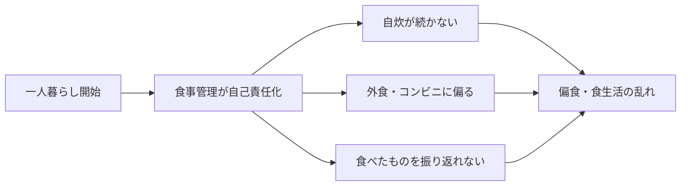
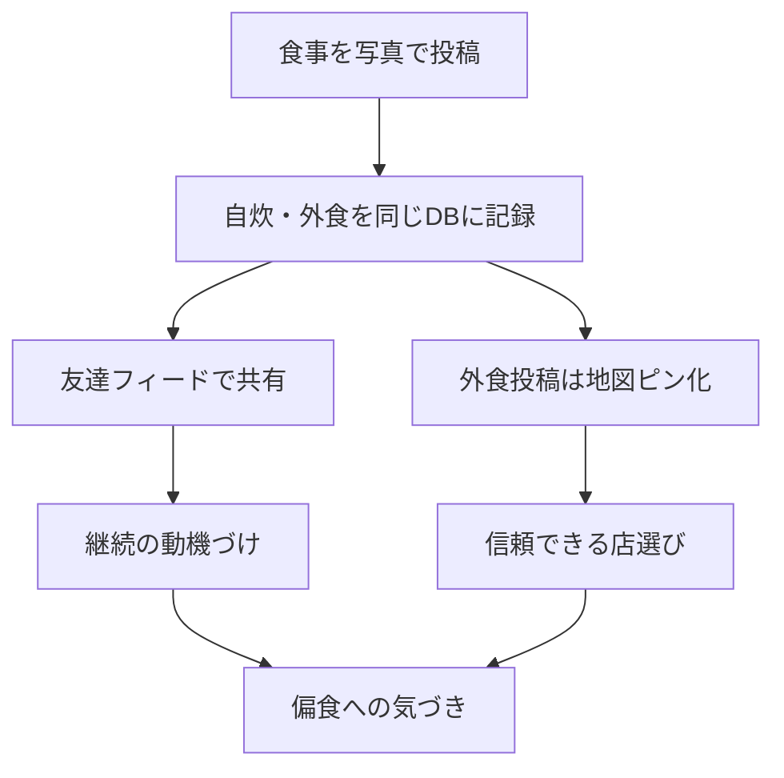
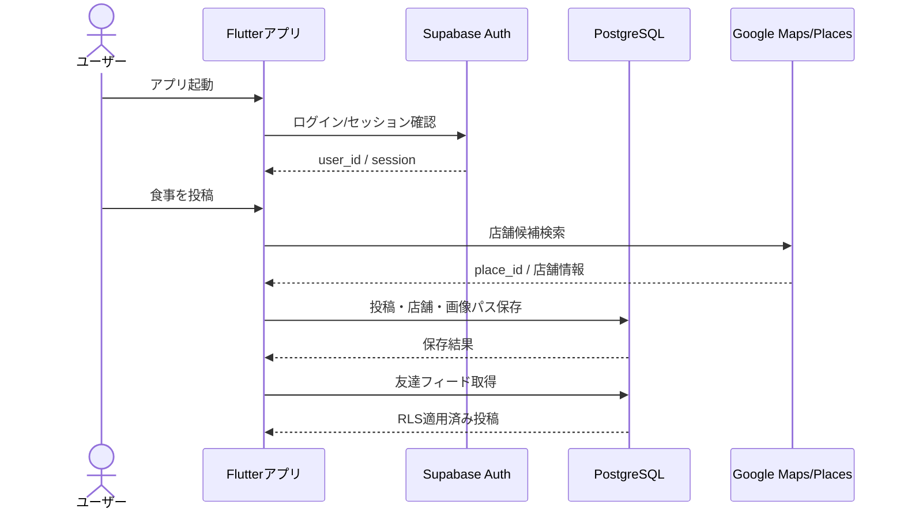
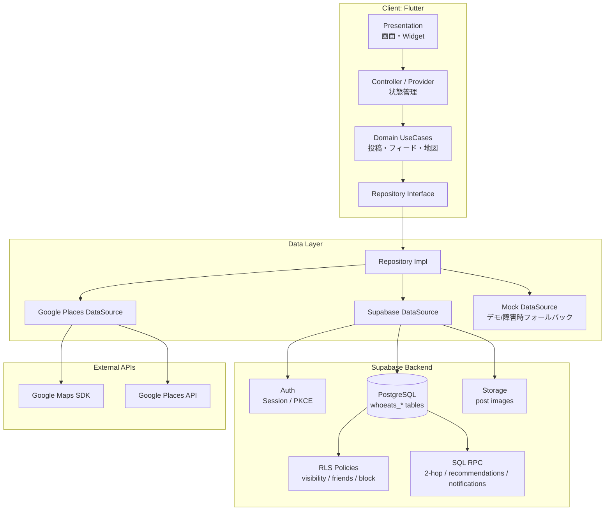
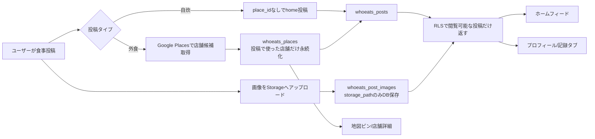
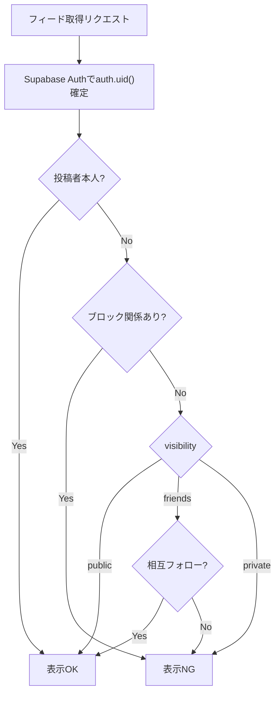
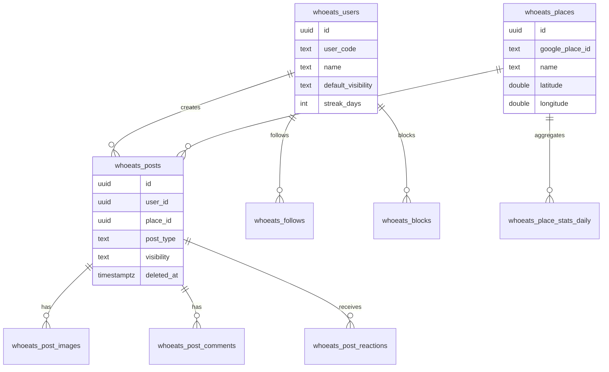
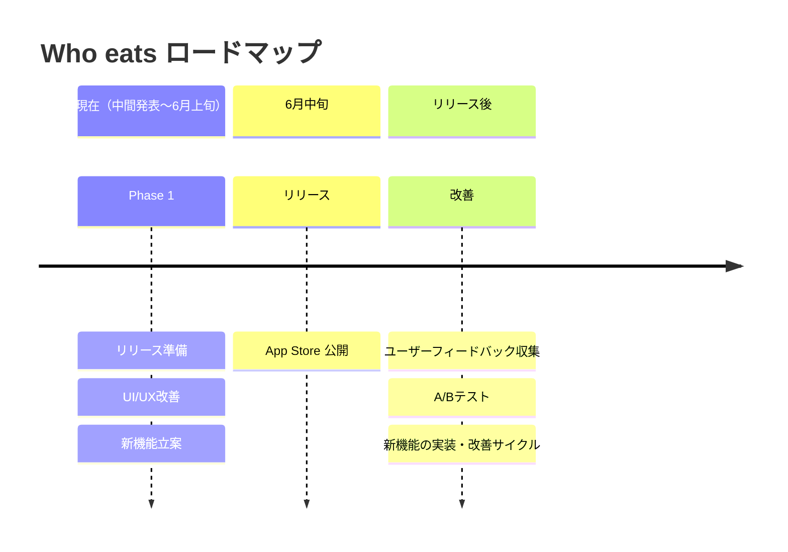

# Who eats — 中間発表スライド構成案

> **発表目的**: 「食生活・偏食」という社会課題に対して、友達 SNS・地図・食事記録を組み合わせた解決策を示し、さらに **信頼性を担保するセキュリティ設計** と **クリーンアーキテクチャ + DB 設計** まで実装方針があることを伝える。  
> **発表の軸**: 地図アプリではなく、**続く食の記録で、偏らない食生活を支えるアプリ**。  
> **参照元**: [中間レポート.md](./中間レポート.md), [who-eats-narrative.md](./who-eats-narrative.md), [assignment-2-solution-design.md](./assignment-2-solution-design.md), [DB設計](../doc/db-table-design-final-mvp.md)  
> **進捗（中間発表時点）**: コア機能は実装・デモ可能。**取り組み中** = Phase 1 リリース準備／新機能立案／開発／UI・UX 改善。**締め** = 6月中旬 App Store → フィードバック・A/B テスト。

---

## 全体ストーリー

1. **課題**: 一人暮らし大学生は食生活を管理しづらく、偏食になりやすい。
2. **転換**: 自炊管理だけでは続かないため、写真投稿 + 友達共有の SNS 型にした。
3. **価値**: 自炊も外食も同じ流れで記録し、友達の投稿から食の選択肢を広げる。
4. **信頼性**: 不特定多数のレビューではなく、友達・相互フォロー・公開範囲・ブロックで見える範囲を制御する。
5. **技術力**: Flutter + Supabase + PostgreSQL + RLS + Storage + Google Maps/Places を、クリーンアーキテクチャで接続済み。コア機能は実装・実機確認まで進んでいる。
6. **いま**: **Phase 1 リリース準備**、新機能の立案・開発、UI/UX 改善に取り組んでいる。
7. **締め**: **6月中旬に App Store リリース** → フィードバック・A/B テストを踏まえて新機能を拡張する。

---

## 推奨スライド構成

| # | タイトル | 主メッセージ | 目安 |
|---|----------|--------------|------|
| 1 | 表紙 | Who eats は「続く食の記録」で偏食を防ぐ | 20秒 |
| 2 | 社会課題 | 一人暮らしで食生活が崩れ、偏食が起きる | 45秒 |
| 3 | 既存サービスの限界 | カロリー管理・グルメサイト・一般SNSでは課題が残る | 40秒 |
| 4 | 解決案 | 食事投稿 SNS + 友達フィード + 地図で継続と選択支援 | 45秒 |
| 5 | 体験フロー | ログイン → 投稿 → 友達フィード → 地図 → 振り返り | 45秒 |
| 6 | システム構成図 | フロント、Backend as a Service、DB、Storage、外部APIを接続 | 55秒 |
| 7 | データフロー図 | 投稿・閲覧・地図表示がどの層を通るかを見せる | 55秒 |
| 8 | セキュリティ・信頼性 | RLS、公開範囲、ブロック、RPC、環境変数で安全性を担保 | 55秒 |
| 9 | DB・設計思想 | クリーンアーキテクチャと正規化DBで拡張可能にする | 45秒 |
| 10 | 進捗・Phase1・スケジュール | 実装済み／取り組み中／App Store・リリース後 | 35秒 |

> 5分発表なら 6〜9 を少し早めに説明する。技術アピールが必要な場では 6〜9 を中心に話す。

---

# スライド詳細

## スライド1 — 表紙

**タイトル**

Who eats  
続く食の記録で、偏らない食生活を

**サブタイトル**

一人暮らし大学生の食生活を、友達との共有と地図で支える食事 SNS

**載せる要素**

- 班名、班番号、発表者名
- 小さく: Flutter / Supabase / PostgreSQL / Google Maps

**話すこと**

「私たちは Who eats という、食事の写真投稿を通じて食生活を記録し、友達と共有できるアプリを開発しています。目的はグルメ評価ではなく、一人暮らしで崩れやすい食生活を続けて記録し、偏食に気づけるようにすることです。」

---

## スライド2 — 社会課題: 一人暮らしと偏食

**主メッセージ**

大学生が急に一人暮らしを始めると、食事管理が自己責任になり、偏食や食事回数の乱れが起きやすい。

**載せる情報**

- 自炊が続かない
- コンビニ、外食、同じ店に偏る
- 何を食べたか振り返れない
- 一人で記録しても習慣化しにくい

**PBL 3条件**

| 条件 | Who eats での当てはめ |
|------|------------------------|
| 切実性 | 班員や周囲の実体験として、一人暮らし後の食生活の乱れがある |
| 普遍性 | 進学、就職、単身生活など、多くの人に起こる |
| ITでの解決 | 投稿、共有、地図、DB、将来の画像解析で可視化できる |

**図表案**

---

## スライド3 — 既存サービスの限界

**主メッセージ**

既存サービスは便利だが、Who eats が扱う「続く食事記録」「友達ベースの信頼」「偏食への気づき」には届きにくい。

**比較表**

| 種類 | 例 | 強み | 限界 |
|------|----|------|------|
| カロリー・献立管理 | あすけん等 | 栄養管理に強い | 入力負担が高く、続けるハードルがある |
| グルメ・地図 | Google Maps / 食べログ | 店舗情報とレビュー数が多い | 不特定多数の評価で、自分に近い人の体験が見えにくい |
| 一般 SNS | Instagram / X | 投稿しやすい | 食生活として構造化されず、振り返りに弱い |
| Who eats | 本アプリ | 友達の食体験 + 食事記録 + 地図 | MVPでは分析機能は今後拡張 |

**強調する一言**

「知らない星5より、友達の一枚」

**話すこと**

「既存のグルメサイトは店選びには強いですが、評価者が自分に近い人か分かりません。一方でカロリー管理アプリは本格的ですが、入力が重く続かない可能性があります。そこで私たちは、写真投稿の軽さと友達ベースの信頼を組み合わせました。」

---

## スライド4 — 解決案: 食事投稿 SNS + 地図

**主メッセージ**

Who eats は、自炊・外食を同じ流れで投稿し、友達と共有することで、食生活の記録を続けやすくする。

**主要機能**

| 機能 | 役割 |
|------|------|
| 食事投稿 | 自炊・外食を写真と短いコメントで記録する |
| 友達フィード | 友達の食事から刺激を受け、継続の動機にする |
| 地図ピン | 外食時に友達が行った店を見つけやすくする |
| いいね・コメント | 記録を一人作業にせず、反応で続けやすくする |
| 記録タブ | 将来、食事回数や偏りの振り返りにつなげる |

**経緯（口頭で触れる）**

当初は自炊管理アプリを想定したが続かないため、SNS 型に転換した。

**図表案**

---

## スライド5 — ユーザー体験フロー

**主メッセージ**

ログインから投稿、友達の閲覧、地図、振り返りまでを一連の体験として実装済み。中間発表ではこの導線をデモできる。

**デモ導線（現状）**

1. ログインまたは新規登録
2. 食事を投稿する
3. 友達の投稿がホームフィードに表示される
4. 外食投稿は地図上のピンとして表示される
5. 投稿にいいね・コメントする
6. プロフィールや記録タブで自分の食生活を振り返る

**図表案: ユーザー操作フロー**

---

## スライド6 — システム構成図

**主メッセージ**

Flutter の UI だけでなく、認証、DB、Storage、RLS、外部 API を組み合わせた実装基盤を設計している。

**載せる構成**

- Flutter: 画面、状態管理、ユースケース呼び出し
- Supabase Auth: メール / LINE 等の認証、PKCE
- Supabase PostgreSQL: ユーザー、投稿、フォロー、店舗、コメント等
- Supabase Storage: 投稿画像
- RLS: DB レベルのアクセス制御
- RPC: 友達推薦、近い人フィード、通知などのサーバー側集計
- Google Maps / Places: 地図表示、店舗検索、店舗詳細

**図表案: システム構成**

**話すこと**

「フロントエンドだけで完結するアプリではなく、認証、DB、画像ストレージ、地図 API を接続しています。さらに DB 側に RLS を置き、クライアントの実装ミスだけに依存しないアクセス制御にしています。」

---

## スライド7 — データフロー: 投稿からフィード・地図表示まで

**主メッセージ**

1回の投稿が、画像、店舗、投稿、友達フィード、地図ピンに分かれて保存・再利用される。

**データフローの見せ方**

**技術的にアピールする点**

- DB に画像本体を入れず、Storage に置き、DB は `storage_path` を保持する。
- 外食投稿だけ `places` と紐づけ、自炊投稿は `place_id = null` で同じ `posts` に入れる。
- 投稿には `public / friends / private` の公開範囲がある。
- 論理削除 `deleted_at` により、誤削除や集計崩れを避ける。
- インデックスで `user_id, created_at` や `place_id, created_at` の表示を高速化する。

---

## スライド8 — 信頼性とセキュリティ設計

**主メッセージ**

Who eats の信頼性は「友達ベースの情報」と「DB レベルのアクセス制御」の2層で担保する。

**信頼性の2層**

| 層 | 内容 | 効果 |
|----|------|------|
| サービス設計 | 友達、相互フォロー、ブロック、公開範囲 | 不特定多数のレビューより、自分に近い情報を見られる |
| 技術基盤 | Supabase Auth、RLS、RPC、Storage、環境変数 | データの見え方・書き込み権限をサーバー側で制御する |

**セキュリティ実装基盤**

| 項目 | 実装方針 |
|------|----------|
| 認証 | Supabase Auth。Flutter 側は PKCE フロー、セッション更新、LINE 連携の準備 |
| 投稿の閲覧制御 | `public / friends / private` を DB 側 RLS で判定 |
| 友達判定 | `is_friends(a, b)` で相互フォローのみを友達扱い |
| ブロック | `is_blocked(a, b)` で双方向に表示・反応を制限 |
| コメント・いいね | 閲覧可能な投稿にだけ作成可能 |
| 画像 | Supabase Storage に保存し、DB にはパスのみ保存 |
| API キー | `.env` と `--dart-define` で管理し、コードに直書きしない |
| 横断集計 | 友達推薦や2ホップ取得は `SECURITY DEFINER` RPC で実行し、RLSを緩めない |

**図表案: RLS による閲覧判定**

**話すこと**

「信頼性は UI の工夫だけではなく、DB の RLS で守ります。たとえば友達限定投稿は、クライアントがフィルタするだけではなく、DB が `auth.uid()`、相互フォロー、ブロック関係を見て返すかどうかを決めます。」

---

## スライド9 — DB 設計とクリーンアーキテクチャ

**主メッセージ**

短期のプロトタイプでも、後から AI 分析や記録タブを足せるように、データとアプリ層を分けている。

**DB テーブルの全体像**

**クリーンアーキテクチャの説明**

| 層 | 役割 | 例 |
|----|------|----|
| Presentation | 画面、Widget、ユーザー操作 | ホーム、地図、投稿、プロフィール |
| Controller / State | 状態管理、画面イベントの整理 | `AppShellController`, `provider` |
| Domain | アプリのユースケース | フィード取得、投稿作成、いいね、友達検索 |
| Repository | Domain からデータ取得方法を隠す | `DashboardRepository` |
| DataSource | Supabase / Google / Mock への実接続 | Supabase, Google Places, Mock |
| DB / External | 永続化・認証・地図 | PostgreSQL, Storage, Maps |

**アピールポイント**

- UI と DB 接続を直接結びつけず、ユースケース単位で分離している。
- Google API や Supabase が不安定な場合でも Mock DataSource でデモを継続できる。
- DB は `whoeats_*` プレフィックスで他アプリとの衝突を避けている。
- DB 変更は PM 承認制にし、テーブル定義・RLS・トリガーを正本管理する。

---

## スライド10 — 進捗・Phase 1・今後のスケジュール

**主メッセージ**

コア機能は **実装済み・実機で動作確認済み**。いまは **Phase 1 のストアリリース準備** と品質向上に集中し、**6月中旬の App Store 公開** を目指す。

### 実装済み（中間発表時点でデモ可能）

| 領域 | 内容 |
|------|------|
| 認証 | ログイン・サインアップ（Supabase Auth） |
| 投稿 | 外食・自炊、画像アップロード、店紐付け |
| ソーシャル | いいね・コメント、フォロー／友達、フィード（友達／近い／すべて） |
| 地図 | Google Map、ピン、店詳細、フィードからの地図フォーカス |
| プロフィール | 編集、`@user_code` 検索、記録タブ（実データ接続） |
| 基盤 | PostgreSQL + RLS + Storage、クリーンアーキテクチャ構成 |

参照: [assignment-3-implementation.md](./assignment-3-implementation.md)、[sprint-1-release-scope.md](../doc/sprint-1-release-scope.md)

### いま取り組んでいること（Phase 1）

| 柱 | 内容 |
|----|------|
| **リリース準備** | App Store 申請用アセット、実機テスト、環境・キー管理の最終確認、ストア文案 |
| **新機能の立案** | リリース後に載せる機能の優先度整理（スプリント2以降のバックログ） |
| **開発** | リリースブロッカー解消、残タスクの実装・バグ修正 |
| **UI / UX 改善** | テーマ・アイコン、画面のピクセル合わせ、空状態・コピーの統一（`UIv2` 基準） |

### 今後のスケジュール（発表の締めで話す）

| 時期 | 内容 |
|------|------|
| **現在〜6月上旬** | Phase 1 完成度向上、TestFlight／審査準備 |
| **6月中旬** | **Apple App Store でリリース** |
| **リリース後** | 利用データ・**フィードバック**と **A/B テスト** に基づき UI・機能を改善 |
| **中長期（候補）** | AI による食事の偏り分析、食事回数管理、栄養士監修・大学連携など |

### 締めの一言（必ずこの流れで）

「中間発表の時点では、ログインから投稿・友達フィード・地図まで動くプロトタイプができています。これからは **Phase 1 のリリース準備と UI/UX の改善** を進め、**6月中旬に App Store で公開** します。そのあとは **フィードバックと A/B テスト** をもとに、ユーザーに本当に使われる機能を少しずつ足していきます。以上です。」

---

# 5分発表台本

## 0:00–0:20 表紙

「基礎工学 PBL、1班です。本日は、一人暮らし大学生の食生活を支えるアプリ Who eats について発表します。Who eats はグルメ評価アプリではなく、続く食の記録で偏らない食生活を支えるアプリです。」

## 0:20–1:05 社会課題

「私たちが注目したのは、大学生が一人暮らしを始めたときに、食事管理がうまくいかず偏食になりやすいという問題です。自炊が続かない、外食やコンビニに偏る、何を食べたか振り返れない、といった課題があります。班員や周囲にも同じような経験があり、切実性があります。また、進学や就職で単身生活を始める人にも広く起こるため、普遍性のある課題だと考えています。」

## 1:05–1:45 既存サービスとの違い

「既存のカロリー管理アプリは栄養管理には強い一方で、入力負担が高く続けにくい面があります。Google Maps や食べログは店舗情報に強いですが、不特定多数のレビューが中心で、自分に近い友達の体験は見えにくいです。そこで Who eats では、写真投稿の軽さと友達ベースの信頼性を組み合わせます。最初は自炊管理アプリを考えましたが、続かないため SNS 型に変えました。」

## 1:45–2:25 解決案とユーザー体験

「ユーザーは、自炊でも外食でも写真と短いコメントで食事を投稿します。友達の投稿はホームフィードに流れ、外食投稿は地図ピンにもなります。これにより、食生活を記録しながら、友達が実際に行った店や食べたものを参考にできます。地図は目的ではなく、偏食を防ぐための選択肢を広げる手段です。」

## 2:25–3:25 システム構成・データフロー

「技術構成は Flutter、Supabase、PostgreSQL、Storage、Google Maps / Places です。Flutter 側は画面、状態管理、ユースケース、リポジトリ、データソースに分けています。投稿時は、画像を Storage に保存し、DB には投稿情報と画像パスを保存します。外食投稿の場合は Google Places の店舗情報と紐づき、地図ピンや店舗詳細に再利用されます。自炊投稿は `place_id` なしで同じ投稿テーブルに保存できるため、食生活全体を一つの流れで扱えます。」

## 3:25–4:20 セキュリティ・信頼性

「信頼性はサービス設計と技術設計の両方で担保します。サービス面では、友達、相互フォロー、公開範囲、ブロックによって、不特定多数ではなく身近な人の体験を中心にします。技術面では Supabase Auth と RLS を使い、DB 側で閲覧権限を制御します。たとえば友達限定投稿は、クライアント側で隠すだけではなく、DB が `auth.uid()`、相互フォロー、ブロック関係を判定して返すかどうかを決めます。友達推薦や2ホップの取得は RPC にして、RLS を緩めずにサーバー側で集計します。」

## 4:20–5:00 進捗・Phase 1・スケジュール（締め）

「進捗ですが、すでにログイン、食事投稿、友達フィード、いいね・コメント、地図、プロフィールまで **実装し、実機で動作確認** できています。いま班では **Phase 1 のリリース準備**、**新機能の立案**、引き続きの **開発**、そして **UI と UX の改善** に取り組んでいます。スケジュールとしては **6月中旬に Apple App Store でリリース** し、その後は **ユーザーのフィードバックと A/B テスト** の結果をもとに、新機能の実装と改善を進めていきます。中長期では食事の偏り分析や栄養面の支援も視野に入れていますが、まずはリリースして実ユーザーから学ぶことを優先します。以上です。」

---

# スライドに載せる図表の優先順位

時間が足りない場合は、以下の4つを必ず入れる。

1. **社会課題の流れ図**: 一人暮らし → 食事管理困難 → 偏食
2. **既存サービス比較表**: カロリー管理 / グルメ地図 / 一般SNS / Who eats
3. **システム構成図**: Flutter + Supabase + PostgreSQL + Storage + Google APIs
4. **RLS 閲覧判定フロー**: public / friends / private / block

技術アピールを強くするなら追加で入れる。

5. **投稿データフロー図**: 投稿 → Storage → DB → Feed / Map / Record
6. **ER 図**: users / posts / places / follows / blocks / comments / reactions
7. **クリーンアーキテクチャ層構造**: Presentation → Domain → Repository → DataSource

---

# 想定質問と回答

| 質問 | 回答の要点 |
|------|------------|
| 食べログや Google Maps と何が違うのか | 店舗評価ではなく、食生活の記録と偏食への気づきが主題。友達ベースの投稿を地図に載せる点が違う。 |
| なぜ続くと言えるのか | カロリー入力ではなく写真 + 短文投稿にし、友達の反応がある SNS 型にするため、記録の心理的負担を下げられる。 |
| 信頼性はどう担保するのか | 不特定多数ではなく友達・相互フォロー中心にし、公開範囲とブロックを DB 側 RLS で制御する。 |
| セキュリティで工夫している点は | Supabase Auth、RLS、Storage、環境変数管理、SECURITY DEFINER RPC により、権限管理をサーバー側に寄せている。 |
| 自炊管理アプリではなくなったのか | 自炊は捨てていない。自炊投稿を `home` 投稿として外食投稿と同じ食事記録の流れに統合している。 |
| AI 分析は実装済みか | リリース後の候補。いまは投稿データの蓄積と Phase 1 リリースが優先。 |
| どこまでできているか | コアフローは実装・デモ可能。いまはリリース準備と UI/UX 改善。 |
| いつリリースするか | **6月中旬に App Store**。その後フィードバック・A/B テストで改善。 |
| API キー流出対策は | `.env` と `--dart-define` で管理し、コードに直書きしない。ブラウザ利用では制限設定も必要。 |
| RLS だけで足りるのか | RLS は DB の最後の防御線。アプリ側でも公開範囲を扱うが、最終的な権限判定を DB 側で行う設計にする。 |
| 6人で開発できるのか | UI、認証/投稿、フィード/ソーシャル、地図、DB/RLS、テスト/発表で分担し、Must を先に固定する。 |

---

# 発表で避ける表現

- 「グルメアプリです」だけで説明する  
  → **食生活・偏食を支えるアプリ** と言う。
- 「地図がメインです」  
  → 地図は **外食時の選択支援の手段** と言う。
- 「まだ設計だけです」  
  → **コア機能は実装済み**。いまは **Phase 1 リリース準備** と言う。
- 「AI で全部解決します」  
  → リリース後の改善サイクルで検討。中間では **動くプロトタイプ + リリース計画** が中心。
- 「友達の投稿だから安全です」  
  → 友達ベースに加えて **RLS・公開範囲・ブロック** で制御すると言う。

---

# 最終確認チェックリスト

- [ ] スライド2で「一人暮らし・偏食」を最初に言う
- [ ] スライド3で既存サービスとの差分を明確にする
- [ ] スライド4で自炊管理→SNS型の経緯を触れる
- [ ] スライド6にシステム構成図を入れる
- [ ] スライド7に投稿データフロー図を入れる
- [ ] スライド8に RLS / Auth / RPC / Storage / API キー管理を入れる
- [ ] スライド9に DB とクリーンアーキテクチャを入れる
- [ ] スライド10で **実装済み**（デモ可能）を伝える
- [ ] **Phase 1**: リリース準備・新機能立案・開発・UI/UX 改善
- [ ] **6月中旬 App Store リリース** → **フィードバック・A/B テスト** で締める
- [ ] AI・栄養士は「リリース後の候補」にとどめる（主張の中心にしない）
